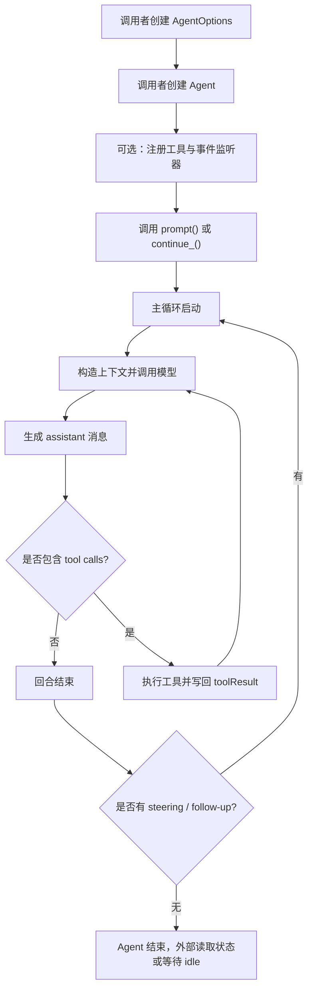

# agentsdk 功能说明

## 1. 文档说明

本文档用于说明 `agentsdk` 已实现的功能与特性，帮助调用者从接入和使用的角度理解 SDK 的能力边界、运行方式和扩展点。全文以仓库中的 `agentsdk/` 目录实现为依据，结论以代码和测试行为为准，不以设计稿、计划文档或预期目标为准。

本文档的目标读者主要包括三类：准备接入 SDK 的上层应用开发者、负责封装 Agent 能力的服务端或客户端工程师，以及维护 SDK 的开发者或评审者。前两类读者通常更关注能力边界、运行语义和接入方式；后一类读者更关注当前版本已经落地的能力与尚未打通的部分。

建议先阅读“SDK 概览”“能力总览”和“典型接入方式”，建立整体理解；随后按需进入“对话驱动能力”“工具调用能力”“流式与事件机制”“模型适配能力”等章节；最后阅读“配置项说明”和“限制与当前边界”，确认当前实现的可用范围。

相关文档：

- [文档导航](./README.md)
- [agentsdk 开发者参考](./agentsdk%20开发者参考.md)
- [概要设计](./概要设计.md)
- [详细设计](./详细设计.md)

## 2. SDK 概览

### 2.1 SDK 定位

`agentsdk` 当前实现的是一个偏运行时内核的 Python Agent SDK。它不以提供完整的平台型能力为目标，也不直接承载技能系统、任务调度、长期记忆、业务策略编排或应用侧上下文构造；它主要负责统一一轮 Agent 运行中最关键的基础能力，包括消息模型、主循环、工具执行、事件分发、状态归约和模型适配。

对调用者而言，这个 SDK 的价值在于，它把“模型调用”“多轮消息推进”“工具执行”“流式输出”“状态观测”等通常分散在上层应用中的基础逻辑收敛成统一运行时。调用者可以围绕 `Agent` 对象组织业务，而不必重复拼接模型输入、处理 tool calls、维护 partial message 或设计消息队列。

### 2.2 SDK 解决的问题

当前 SDK 主要面向以下场景：

- 需要在一个统一对象中管理多轮对话上下文与运行状态。
- 需要支持工具调用，并希望在工具调用前后接入自己的安全策略、结果治理或业务逻辑。
- 需要支持流式输出，并通过事件机制把运行过程同步到 UI、CLI、日志系统或外部状态存储。
- 需要在运行过程中插入 steering 或 follow-up 消息，而不是每次都从零重建完整 prompt。
- 需要在模型适配层与 Agent Runtime 内核之间保持清晰边界。

### 2.3 SDK 不负责的内容

当前 SDK 不直接负责以下事项：

- 技能系统、知识库、长期记忆管理。
- 计划任务或任务调度系统。
- 业务领域专用工具集和业务策略本身。
- 完整的平台化权限体系或多租户治理体系。
- 多个模型供应商的统一接入平台。

因此，调用者应将 `agentsdk` 理解为“可被外部应用嵌入的 Agent Runtime Kernel”，而不是“开箱即用的一体化 Agent 平台”。

## 3. 能力总览

### 3.1 能力总表

| 能力类别 | 当前支持的功能 | 主要实现模块 | 调用者价值 |
| --- | --- | --- | --- |
| 对外入口 | `Agent`、消息模型、事件模型、配置模型、错误类型导出 | `agentsdk/__init__.py`、`agentsdk/runtime/__init__.py` | 统一入口，便于外部应用直接接入 |
| 对话运行 | `prompt()`、`continue_()`、`steer()`、`follow_up()`、`abort()`、`wait_for_idle()`、`reset()` | `agentsdk/runtime/agent.py` | 支撑多轮对话和运行中控制 |
| 主循环 | prompt 场景与 continuation 场景下的循环推进 | `agentsdk/runtime/loop.py` | 统一处理模型回复、工具调用和追加消息 |
| 消息模型 | user / assistant / toolResult 消息，以及 text / image / thinking / toolCall 内容块 | `agentsdk/runtime/models.py` | 统一对话、工具结果和流式中间态的数据结构 |
| 工具调用 | 工具查找、参数预处理、参数校验、错误收敛 | `agentsdk/runtime/tool_executor.py` | 降低工具接入复杂度 |
| 工具扩展 | `before_tool_call`、`after_tool_call`、`on_update` | `agentsdk/runtime/config.py`、`agentsdk/runtime/tool_executor.py` | 允许业务侧插入策略、治理和进度上报 |
| 执行模式 | 串行和并行两种工具执行模式 | `agentsdk/runtime/tool_executor.py` | 在一致性与效率之间做平衡 |
| 流式处理 | 流式响应统一收敛为最终消息，并持续产出更新事件 | `agentsdk/runtime/stream_handler.py` | 支持 CLI / UI 的增量呈现 |
| 事件机制 | agent、turn、message、tool execution 四类事件 | `agentsdk/runtime/events.py` | 便于做观测、日志和状态同步 |
| 状态管理 | transcript、当前流式消息、待完成工具调用、错误信息 | `agentsdk/runtime/state.py` | 允许外部系统随时读取运行快照 |
| 运行控制 | 取消令牌与 run 句柄 | `agentsdk/runtime/run_control.py` | 支持中止执行和等待完成 |
| 模型适配 | OpenAI Chat Completions 适配 | `agentsdk/adapters/openai_chatcompletions.py` | 当前可直接接 OpenAI 风格接口 |

### 3.2 当前能力特征概括

从整体上看，当前 SDK 的能力可以概括为三层。第一层是运行时基础层，负责消息、状态、事件和取消控制；第二层是执行编排层，负责主循环推进、工具执行和 continuation 语义；第三层是适配层，负责把统一运行时与具体模型接口连接起来。

这种分层结构意味着，调用者既可以把它作为一个“直接拿来用的 Agent 对象”，也可以把它视为一个可以继续扩展和封装的基础设施组件。

## 4. 典型接入方式

### 4.1 标准接入路径

对于一个首次接入的调用者而言，最常见的使用路径通常如下：

1. 创建 `AgentOptions`，声明模型、工具、上下文处理逻辑和扩展 Hook。
2. 构造 `Agent` 对象，作为后续所有运行的统一入口。
3. 如有需要，注册事件监听器，用于流式展示、日志记录或外部状态同步。
4. 通过 `prompt()` 发起新输入，或者通过 `continue_()` 基于既有 transcript 继续运行。
5. 在运行过程中，由 SDK 自动完成模型调用、流式消息处理、工具执行和后续轮次推进。
6. 通过 `Agent.state` 读取当前状态，或通过 `wait_for_idle()` 等待本轮完全结束。

### 4.2 接入流程图

### 4.3 接入要点

接入时最重要的理解是，`Agent` 并不是“发送一次请求，返回一次结果”的简单封装，而是一个可持续运行的对话执行器。调用者发起的并不是单一模型调用，而是一轮完整 run。这个 run 可能包含若干轮模型交互、若干次工具执行、若干条追加消息，以及一系列生命周期事件。

## 5. 核心对象与核心概念

### 5.1 Agent

`Agent` 是当前 SDK 的核心对象，也是调用者几乎所有操作的入口。它既持有运行时状态，也负责接收外部输入、驱动主循环、管理消息队列、分发事件并对取消、收尾和等待 idle 等操作提供统一接口。

### 5.2 消息

当前 SDK 定义了三类消息：

| 消息类型 | 说明 | 典型来源 |
| --- | --- | --- |
| `UserMessage` | 用户输入消息 | 调用者通过 `prompt()` 或直接构造传入 |
| `AssistantMessage` | 模型回复消息 | 模型流式或非流式返回，经 SDK 收敛得到 |
| `ToolResultMessage` | 工具执行结果消息 | 工具执行后由 SDK 写回 transcript |

消息是整个运行过程中的核心载体。主循环围绕它们推进，状态记录围绕它们归约，模型上下文和工具输入输出也围绕它们组织。

### 5.3 内容块

不同消息内部可以承载不同类型的内容块。当前实现支持如下内容：

| 内容块类型 | 当前作用 |
| --- | --- |
| `TextContent` | 表示普通文本内容 |
| `ImageContent` | 表示图片输入或输出 |
| `ThinkingContent` | 表示 thinking / reasoning 类内容 |
| `ToolCallContent` | 表示 assistant 发出的工具调用请求 |

当前用户消息支持文本和图片；assistant 消息支持文本、图片、thinking 和 tool call；工具结果消息支持文本和图片。这说明 SDK 已具备承载多模态输入与工具调用的统一消息结构。

需要注意的是，这里描述的是统一消息模型的结构能力；在默认 OpenAI Chat Completions 适配器下，端到端已经打通的重点仍是用户图片输入，以及 assistant 文本 / thinking / tool call 和工具结果的基础映射。

### 5.4 工具

工具在 SDK 中不是普通函数，而是一类带固定协议的执行对象。工具至少需要提供名称、标签、参数 schema 和异步执行方法。SDK 会基于这些字段完成工具发现、参数准备、参数校验、执行调度和结果回写。

### 5.5 事件

事件是 SDK 向外暴露运行过程的主要机制。调用者可以通过订阅事件，实时感知 Agent 生命周期、回合变化、消息更新和工具执行进度。这使得 SDK 可以被自然地接入 UI、CLI、日志系统和外部观测系统。

### 5.6 状态

状态是对当前运行快照的对外暴露。相较于事件强调“变化发生了什么”，状态强调“此刻系统处于什么状态”。SDK 当前通过 `Agent.state` 提供只读快照视图，帮助调用者在任意时刻读取 transcript、流式中间态和错误信息。

### 5.7 上下文

上下文是发给模型的消息集合及其相关环境信息。当前 SDK 会先从内部状态中构造上下文，再通过 `transform_context` 和 `convert_to_llm` 两层机制对其进行变换，最后交由适配层发送给模型。

## 6. 对话驱动能力

### 6.1 发起新输入：`prompt()`

`prompt()` 用于发起一轮新的输入。调用者可以传入字符串、单条消息或消息列表。对于最常见的字符串输入场景，SDK 会自动将其包装成一条 `UserMessage`。如果调用时同时传入 `images`，图片也会被并入这条用户消息中，形成一条混合内容消息。

这一设计降低了接入门槛。对于简单应用而言，调用者无需自己构造消息对象即可发起一轮交互；对于复杂场景而言，也仍然可以直接传入自己构造的消息。

### 6.2 基于现有 transcript 继续运行：`continue_()`

`continue_()` 的作用并不是重复调用上一轮，而是让 Agent 基于当前 transcript 边界继续推进。当前实现对 continuation 有明确约束。

当 transcript 为空时，`continue_()` 无法执行；当最后一条消息是 assistant，且没有任何排队消息时，也无法执行；但如果最后一条是 assistant，且 steering 或 follow-up 队列中已有新消息，则允许继续；如果最后一条不是 assistant，例如停在 user 或 toolResult 上，也允许继续。

这说明 continuation 在当前 SDK 中是一种有边界语义的恢复机制，而不是“无条件再跑一次”。

### 6.3 运行中插入 steering 消息：`steer()`

`steer()` 用于将消息加入 steering 队列。steering 更适合表示“运行中的即时转向”。主循环在每个回合结束后会优先拉取 steering 队列中的内容，因此这类消息具有更高的插入优先级。

因此，`steer()` 适合用于“在当前运行尚未结束时插入更高优先级要求”这一类场景，例如用户临时补充关键约束，或系统在运行过程中追加更高优先级信息。

### 6.4 运行结束后追加 follow-up 消息：`follow_up()`

`follow_up()` 用于将消息加入 follow-up 队列。与 steering 相比，follow-up 更适合表示“当前一轮链路收束后，再继续处理的补充内容”。主循环只有在工具链和 steering 消息都消化完毕后，才会消费 follow-up。

因此，`follow_up()` 适合用于“当前链路收束后继续处理补充内容”的场景，例如自动追问、补充澄清或串联后续步骤。

### 6.5 中止与收尾：`abort()`、`wait_for_idle()`、`reset()`

`abort()` 用于请求取消当前运行。它不保证在任意语句点即时停止，而是通过取消令牌让下游在合适的检查点感知取消，并尽量收敛为一个明确的 aborted 结束消息。

`wait_for_idle()` 用于等待当前运行彻底结束。这里的“结束”不仅包括模型调用和工具执行完成，也包括事件监听器执行完毕，因此可以作为较严格的收尾边界。

`reset()` 则用于清空 transcript 和运行态字段，并清空 steering、follow-up 两个队列。它适合在调用者明确需要“重新开始一个全新会话”时使用。

## 7. 运行流程与执行语义

### 7.1 一次 run 的推进过程

当前 SDK 的主循环并不是一次模型调用，而是一段完整的运行过程。它通常按如下方式推进：先读取当前上下文和排队消息，再调用模型生成 assistant 消息；若 assistant 消息中包含 tool calls，则执行工具，并把工具结果写回上下文；随后重新进入模型调用；当没有新的 tool calls，也没有更高优先级的 steering 消息时，再检查 follow-up 队列；所有内容处理完后，本轮 Agent run 才结束。

因此，调用者应把一次 run 理解为一个“可能由多轮模型与工具交替组成的执行闭环”，而不是一个单步请求。

### 7.2 steering 与 follow-up 的优先级

当前实现中，steering 优先级高于 follow-up。只要 steering 队列中还有消息，主循环就会优先处理 steering；只有当前轮次和 steering 都消化完毕，follow-up 才会开始进入新的轮次。

这一点对设计调用方业务逻辑很关键。如果同一时间存在两类追加消息，steering 会先被纳入模型上下文。

### 7.3 队列消费模式

steering 和 follow-up 队列都支持两种消费模式：`one-at-a-time` 和 `all`。前者表示每次只取出一条消息，后者表示每次把当前积压的消息全部取出。调用者可以根据自己的交互策略决定是偏向“严格逐条推进”，还是偏向“批量吞吐”。

## 8. 消息模型与上下文组织

### 8.1 消息结构说明

当前消息结构不仅用于保存 transcript，也用于驱动运行和适配模型接口。`UserMessage` 表示调用者输入；`AssistantMessage` 表示模型输出；`ToolResultMessage` 表示工具执行回写。assistant 消息中的 `stop_reason`、`error_message`、`usage` 等字段，进一步使其能够表达正常结束、工具调用触发、错误结束和取消结束等状态。

### 8.2 内容表达方式

从内容表达看，SDK 已经具备如下特点：

- 文本内容通过 `TextContent` 表达。
- 图片内容通过 `ImageContent` 表达。
- thinking 类型内容已有统一结构定义。
- 工具调用请求通过 `ToolCallContent` 表达，并包含 `id`、`name` 和 `arguments`。

对调用者而言，这意味着 transcript 不只是“文本串”，而是一个可以稳定承载多种内容形态的结构化历史。

### 8.3 上下文进入模型前的处理

在进入模型调用之前，上下文会依次经过两个环节。第一步是 `transform_context`，它允许调用者对内部消息序列做压缩、裁剪、重排或补充；第二步是 `convert_to_llm`，它允许调用者把内部消息结构转换成模型适配层所期望的消息格式。

当前默认的 `convert_to_llm` 行为比较保守，只会保留 `user`、`assistant` 和 `toolResult` 三类消息，并不做复杂映射。因此，如果调用者需要更强的协议定制能力，通常需要自行提供这两个扩展点中的一个或两个。

## 9. 工具调用能力

### 9.1 工具调用链路

当前工具执行链路可概括为九个步骤：识别 assistant 消息中的工具调用；在已注册工具中按名称查找工具；如有需要先调用 `prepare_arguments`；按工具的 `input_schema` 做参数校验；执行 `before_tool_call`；调用工具本身；收集中间更新；执行 `after_tool_call`；最终把结果封装为 `ToolResultMessage` 回写 transcript。

这种设计使得工具从“模型发起调用”到“结果回到对话历史”之间形成了一个完整闭环。

### 9.2 参数准备与参数校验

工具参数在当前 SDK 中可以先做预处理，再做校验。`prepare_arguments` 适合把模型生成的原始参数转换成工具真正期望的格式，例如补默认值、重组结构或做类型转换。随后 SDK 会根据 `input_schema` 执行轻量级的 JSON Schema 风格校验。

当前校验能力已支持对象、数组和常见标量类型，也支持 `required`、`properties`、`items` 和 `additionalProperties`。虽然它不是完整 JSON Schema 引擎，但足以覆盖当前工具参数管理的大多数基础场景。

### 9.3 工具错误处理方式

当前 SDK 不会把工具异常直接视为整个 run 的致命失败。无论是工具不存在、参数校验失败、工具前置 Hook 阻断，还是工具自身抛出异常，当前实现都会尽量将问题收敛为一条错误型 `ToolResultMessage`，并继续把这条结果纳入 transcript。

这样一来，模型和调用者都能观察到“工具调用失败”的结果，并据此决定后续行为。对于强调运行过程可观测性和连续性的系统，这种处理方式更便于接入和排障。

## 10. 工具执行策略与扩展点

### 10.1 串行与并行执行模式

当前 SDK 支持两种工具执行模式：串行和并行。串行模式下，工具调用严格按顺序准备、执行和收尾；并行模式下，SDK 会先按原始 tool call 顺序完成准备，再并发执行可运行的工具调用。

并行模式有一个重要保证：工具可以乱序完成，但最终结果的写回顺序仍然保持与 assistant 原始 tool call 顺序一致。这一特性既保留了并发收益，也保持了 transcript 的稳定性和可预期性。

### 10.2 `before_tool_call`

`before_tool_call` 是工具执行前的扩展点。它可以看到 assistant 原消息、当前 tool call、准备好的参数以及当前上下文。调用者可以利用这一 Hook 实现安全检查、权限校验、业务规则拦截或灰度控制。

当 Hook 返回阻断结果时，SDK 不会执行工具，而是直接生成一条错误型工具结果，并把阻断原因作为结果内容的一部分。

### 10.3 `after_tool_call`

`after_tool_call` 是工具执行后的扩展点。它可以读取工具原始结果，并在需要时改写返回内容、结构化详情和错误标记。调用者可以利用这一机制完成结果脱敏、结果规范化、摘要化处理或错误语义调整。

这一 Hook 使调用者能够把 SDK 内核层和业务策略层清晰分离。SDK 负责保证执行流程，调用者负责治理最终暴露给模型和上层系统的结果。

### 10.4 工具中间更新

工具执行时可以通过 `on_update` 上报中间 `AgentToolResult`。SDK 会把这些中间结果转成 `ToolExecutionUpdateEvent` 并对外发出。这一能力适合长任务工具，例如搜索、检索、分步抓取、多阶段代码分析等。

从调用者角度看，这意味着工具不再局限于“一次调用一次返回”，而可以逐步暴露执行进度。

## 11. 流式输出与事件机制

### 11.1 流式消息处理

`stream_assistant_response()` 的职责，是把模型适配层返回的流式事件或非流式结果统一收敛为一个最终的 `AssistantMessage`。对于流式场景，SDK 会先建立 partial assistant message，并在每次增量事件到来时刷新这一 partial message；对于非流式场景，SDK 仍然会以统一契约发出消息开始和结束事件。

这种实现使调用者不需要分别处理“流式模型”和“非流式模型”的两套逻辑，而只需要面向统一的消息生命周期。

### 11.2 事件分类

当前 SDK 的事件可以分为四类：

| 事件类别 | 事件类型 | 作用 |
| --- | --- | --- |
| Agent 级 | `agent_start`、`agent_end` | 标记一轮 Agent run 的开始与结束 |
| Turn 级 | `turn_start`、`turn_end` | 标记一轮回合的开始与结束 |
| Message 级 | `message_start`、`message_update`、`message_end` | 标记消息从产生到完成的整个生命周期 |
| Tool 级 | `tool_execution_start`、`tool_execution_update`、`tool_execution_end` | 标记工具执行过程和进度变化 |

### 11.3 事件对调用者的意义

事件机制的意义在于，调用者可以把 SDK 的内部运行过程映射到自己的外部系统中。对于 CLI，可以利用 `message_update` 做打字机效果；对于 Web UI，可以根据事件增量刷新页面；对于日志系统和埋点系统，可以在各类生命周期事件上做记录；对于服务端状态存储，可以根据事件同步持久化状态。

### 11.4 `wait_for_idle()` 与监听器语义

当前实现中，`wait_for_idle()` 等待的不只是模型和工具逻辑本身，还包括所有已注册监听器执行完毕。因此，对于需要严格收尾的系统，可以把 `wait_for_idle()` 视为“本轮 run 已完全完成”的信号。

## 12. 状态读取与运行观测

### 12.1 状态视图

SDK 内部维护可变状态，但对外暴露的是 `AgentStateView` 只读快照。当前可读取的关键状态包括：

- `messages`：完整 transcript
- `is_streaming`：当前是否仍在运行
- `streaming_message`：当前消息生命周期中的最新快照，在流式生成阶段通常表现为 partial assistant message
- `pending_tool_calls`：尚未结束的工具调用集合
- `error_message`：最近一次运行中记录的错误信息

### 12.2 状态与事件的配合方式

在调用者视角下，事件和状态不是重复机制，而是互补机制。事件更适合驱动“变化发生时要做什么”，状态更适合回答“此刻系统是什么样”。一种常见用法是：监听事件推动外部系统更新，再通过状态读取当前快照进行展示或校验。

### 12.3 状态保护方式

当前对外暴露的是以只读访问为主的状态视图：`messages`、`model` 和 `streaming_message` 等读取结果会做拷贝保护，`tools` 则以只读元组形式暴露。因此，调用者可以安全读取消息历史和关键运行状态，而不会直接改写 SDK 内部消息数据。这使状态读取适合被多个外部模块共同使用。

## 13. 模型适配能力

### 13.1 适配层的职责

模型适配层的作用，是把 SDK 的统一运行时模型转换成具体供应商 API 所需的输入输出形式。对于上层调用者而言，适配层承担两项核心职责：第一，把内部消息、工具定义和运行配置映射成供应商协议；第二，把供应商返回的普通响应和流式 chunk 转回 SDK 自己的统一事件和消息。

### 13.2 当前已实现的适配能力

当前代码中真正实现的模型适配层只有一个，即 `OpenAIChatCompletionsAdapter`。它面向 OpenAI 风格的 `chat.completions` 接口工作，并已具备基础消息映射、工具映射、流式 delta 处理和工具参数增量恢复等能力。

## 14. OpenAI Chat Completions 适配说明

### 14.1 消息映射

当前适配器支持把用户消息中的文本和图片映射成 OpenAI 风格的 `messages`；支持把 assistant 消息中的文本和 tool calls 映射成 OpenAI assistant 消息；支持把工具结果消息映射成 OpenAI 的 `tool` 角色消息。
其中，工具结果里的图片当前会在 `tool` 消息中退化为占位文本；assistant 输出图片也还没有在默认适配器里形成专门的协议映射。

因此，从调用者角度看，只要上层继续使用 SDK 统一消息模型，就不需要直接操作 OpenAI 原生请求结构。

### 14.2 工具映射

已注册工具会被适配器映射为 OpenAI `tools` 参数。工具的 `name`、`description` 和 `input_schema` 都会参与这部分映射，从而使模型能够在返回中生成与之匹配的 tool calls。

### 14.3 流式事件映射

当前适配器能把 OpenAI 的流式 chunk 转换为 SDK 统一流式事件，包括：

- `AssistantStreamStart`
- `AssistantTextDelta`
- `AssistantThinkingDelta`
- `AssistantToolCallDelta`
- `AssistantStreamDone`
- `AssistantStreamError`

适配后，Runtime 上层只需要面向 SDK 内部事件工作，而无需理解 OpenAI 原生 chunk 的字段细节。

### 14.4 流式 tool call 参数恢复

OpenAI 的流式工具调用参数通常以分段字符串形式返回，中途往往并不是合法 JSON。当前适配器会按 tool call 的 `index` 聚合参数字符串，尝试修复不完整 JSON，并在能够成功解析时，实时把 `arguments` 字段更新为当前可用的对象。

这一能力对调用者非常重要，因为它让流式过程中看到的不再只是残缺的原始字符串，而是一个逐步成形的结构化参数对象。

## 15. 配置项说明

### 15.1 调用者最常使用的配置项

当前 `AgentOptions` 中，调用者最常关注的配置项包括：

| 配置项 | 当前作用 |
| --- | --- |
| `system_prompt` | 保存系统提示词文本；默认 OpenAI 适配器会把它作为首条 system message 注入请求 |
| `model` | 声明当前模型元信息 |
| `tools` | 注册可执行工具列表 |
| `messages` | 初始化 transcript |
| `stream_fn` | 指定模型响应获取方式，属于核心配置 |
| `convert_to_llm` | 控制内部消息如何转给模型 |
| `transform_context` | 控制模型调用前如何处理上下文 |
| `before_tool_call` / `after_tool_call` | 控制工具前后治理策略 |
| `tool_execution` | 指定串行还是并行工具模式 |
| `temperature` / `top_p` / `max_tokens` | 影响当前 OpenAI 适配层的请求参数 |
| `api_key` / `get_api_key` | 提供模型调用认证信息 |
| `metadata` | 透传附加元信息到适配层请求中 |

### 15.2 已建模但未完全打通的配置项

当前还有一些字段已经建模并能够进入配置对象，但尚未形成完整闭环：

| 配置项 | 当前状态 |
| --- | --- |
| `thinking_level` | 已定义并保存，但尚未参与实际请求控制 |
| `thinking_budgets` | 已定义并传递，但尚未参与执行逻辑 |
| `max_retry_delay_ms` | 已定义，但当前没有重试机制使用它 |
| `session_id` | 已定义并进入配置，但当前没有实际消费方 |
| `on_payload` | 已定义，但当前未被执行链路调用 |
| `base_url` | SDK 配置中存在，但当前适配层不直接消费它 |

阅读配置项时，需要特别区分“字段存在”与“能力已实际生效”这两个层次。

## 16. 限制、当前边界与验证结论

### 16.1 `system_prompt` 在默认 OpenAI 链路中已自动进入请求

当前 `system_prompt` 不仅会保存在状态和配置中，默认 `OpenAIChatCompletionsAdapter` 在构造 OpenAI Chat Completions 请求时，也会在消息列表最前面追加一条 system message。因此，在当前默认链路下，`system_prompt` 已经属于默认生效字段，而不再只是“已建模但未注入请求”的保留配置。

### 16.2 当前只有 OpenAI Chat Completions 适配

从当前代码看，还没有其他模型供应商的适配器，也没有 Responses API、Anthropic、Gemini 或本地模型接入实现。因此，当前 SDK 的适配层能力应被准确理解为“已实现 OpenAI Chat Completions 适配”，而不是“已具备完整多模型平台能力”。

### 16.3 `ToolPreparationError` 当前不是主要错误呈现方式

虽然 `ToolPreparationError` 已经被定义并在 runtime 层导出，但工具准备阶段的失败在当前执行链路中通常会被收敛为错误型工具结果，而不是显式抛出该异常。因此，从调用者会实际观察到的行为来看，当前更常见的是 transcript 中出现一条错误型 `ToolResultMessage`。

### 16.4 当前仓库中的 OpenAI 适配层已通过现有测试验证

当前 `agentsdk/adapters/openai_chatcompletions.py` 的导入路径已经与 `agentsdk` 包名保持一致。在当前仓库执行 `uv run pytest agentsdk/tests -q` 时，现有 13 项测试可以通过。

这说明，SDK 运行时主体能力和默认 OpenAI 适配层的基础映射链路已经能够在当前目录结构下完成回归验证。不过，这一结论仍应被理解为“现有实现范围内的测试已通过”，而不是“所有扩展场景都已完全验证完毕”。

## 17. 示例与建议阅读路径

### 17.1 示例程序的作用

仓库中的 `agent_sdk_demo.py` 提供了一个简单的终端聊天示例。它展示了如何创建 OpenAI 客户端、构造 `OpenAIChatCompletionsAdapter`、创建 `Agent`、订阅消息事件，并在终端中打印流式文本。这份示例适合作为调用者理解 SDK 接入最短闭环的辅助材料。

### 17.2 建议阅读顺序

对于希望接入 SDK 的调用者，建议优先阅读以下顺序：

1. “SDK 概览”，先确认 SDK 的定位与边界。
2. “能力总览”，建立整体地图。
3. “典型接入方式”，理解最短接入闭环。
4. “对话驱动能力”和“运行流程与执行语义”，理解 run 是如何推进的。
5. “工具调用能力”和“工具执行策略与扩展点”，理解如何接工具和插入业务逻辑。
6. “流式输出与事件机制”以及“状态读取与运行观测”，理解如何对接 UI、CLI 或日志系统。
7. “模型适配能力”“OpenAI Chat Completions 适配说明”和“限制与当前边界”，确认当前实现的真实可用范围。

## 18. 附录

### 18.1 错误类型一览

| 错误类型 | 当前含义 |
| --- | --- |
| `AgentRuntimeError` | SDK 运行时错误基类 |
| `AgentAlreadyRunningError` | 当前已有 run 在执行时，再次发起 prompt 或 continue |
| `InvalidContinuationError` | continuation 边界不合法 |
| `ListenerOutsideRunError` | 在无活动 run 的上下文中触发监听逻辑 |
| `ToolPreparationError` | 已定义并在 runtime 层导出，但当前不是主要错误暴露形式 |
| `OpenAIAdapterError` | OpenAI 适配相关错误 |

### 18.2 事件类型一览

| 事件类型 | 当前含义 |
| --- | --- |
| `agent_start` | 一轮 Agent run 开始 |
| `agent_end` | 一轮 Agent run 结束 |
| `turn_start` | 一轮 turn 开始 |
| `turn_end` | 一轮 turn 结束 |
| `message_start` | 某条消息开始进入 transcript 或流式阶段 |
| `message_update` | 某条 assistant 消息在流式过程中发生更新 |
| `message_end` | 某条消息完成 |
| `tool_execution_start` | 某个工具调用开始执行 |
| `tool_execution_update` | 某个工具调用产生中间更新 |
| `tool_execution_end` | 某个工具调用执行结束 |

### 18.3 公开状态字段一览

| 状态字段 | 当前含义 |
| --- | --- |
| `system_prompt` | 当前状态中保存的系统提示词 |
| `model` | 当前模型信息 |
| `thinking_level` | 当前 thinking 级别配置值 |
| `tools` | 当前已注册工具集合 |
| `messages` | 当前完整 transcript |
| `is_streaming` | 当前是否仍在执行中 |
| `streaming_message` | 当前消息生命周期中的最新快照，流式阶段通常表现为 partial assistant message |
| `pending_tool_calls` | 尚未完成的工具调用集合 |
| `error_message` | 当前状态中记录的错误信息 |

## 19. 总结

从当前代码实现来看，`agentsdk` 已具备一个可工作的 Agent Runtime 内核所需的核心能力：能够统一管理消息、上下文、主循环、工具调用、事件流和状态视图，并通过 OpenAI Chat Completions 适配层与具体模型接口连接起来。

如果从调用者需求概括，这个 SDK 已经可以支撑“多轮对话 + 工具调用 + 流式事件 + 状态观测”这一类基础 Agent 应用；如果从成熟度概括，仍有部分预留配置项和适配层边界尚未完全打通。因此，现阶段更适合将它作为可扩展、可封装的运行时基础设施接入，而不是作为一体化 Agent 平台直接使用。
